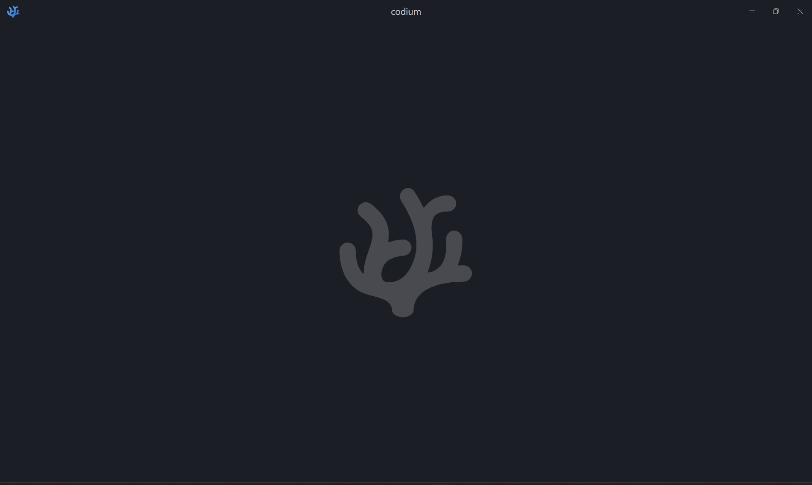
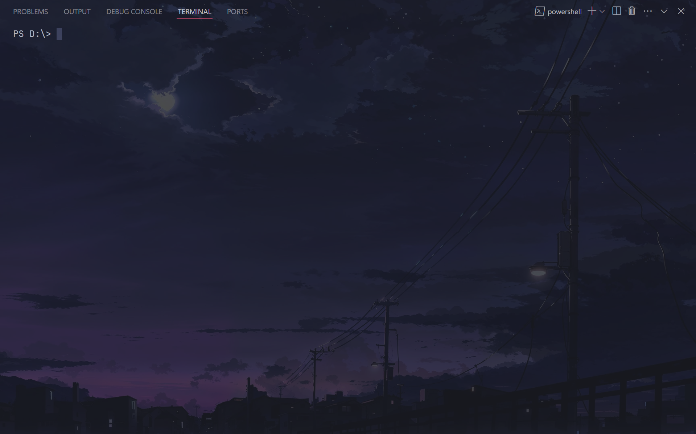

## Минималистичнчй конфиг для VS Codium

В конфигурации имеются подсказки для настройки под себя.

Для корректной работы конфигурации:
- Нажмите клавишу `f11` для перехода в полноэкранный режим (при запуске нового окна это также потребуется)
- скачать тему [Horizon Bold](https://github.com/jolaleye/horizon-theme-vscode)
- скачать шрифт [Jetbrains Mono](https://www.jetbrains.com/lp/mono)
- установить расширение [Background](https://github.com/shalldie/vscode-background)
- фоновые изображения задавать через `file protocol` (Пример: `file:///C:/Users/user/Desktop/file.jpg`)

Было:

Стало:

